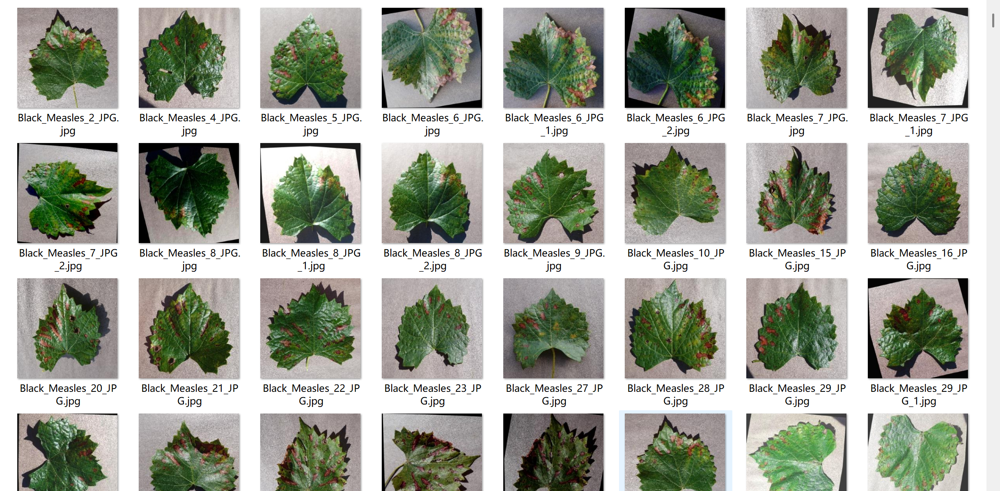
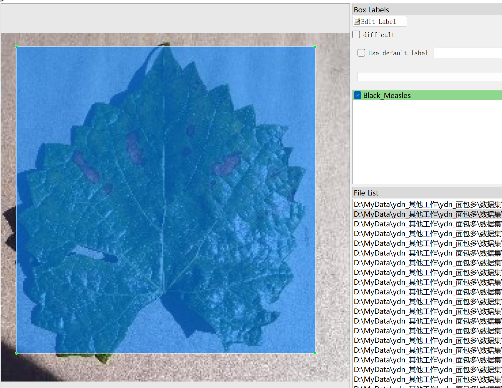
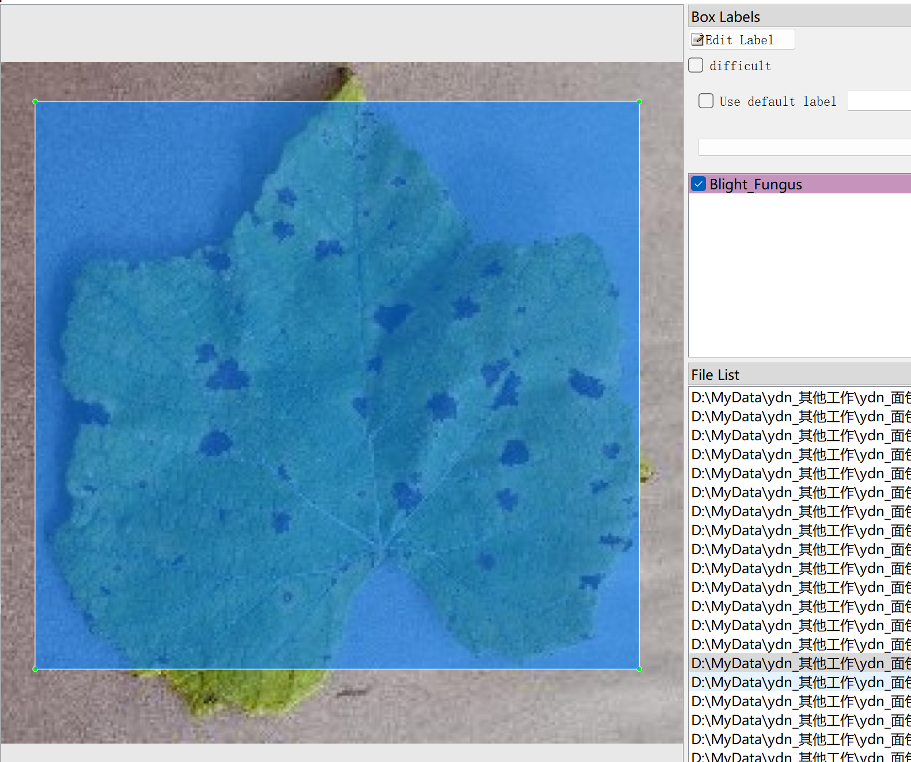
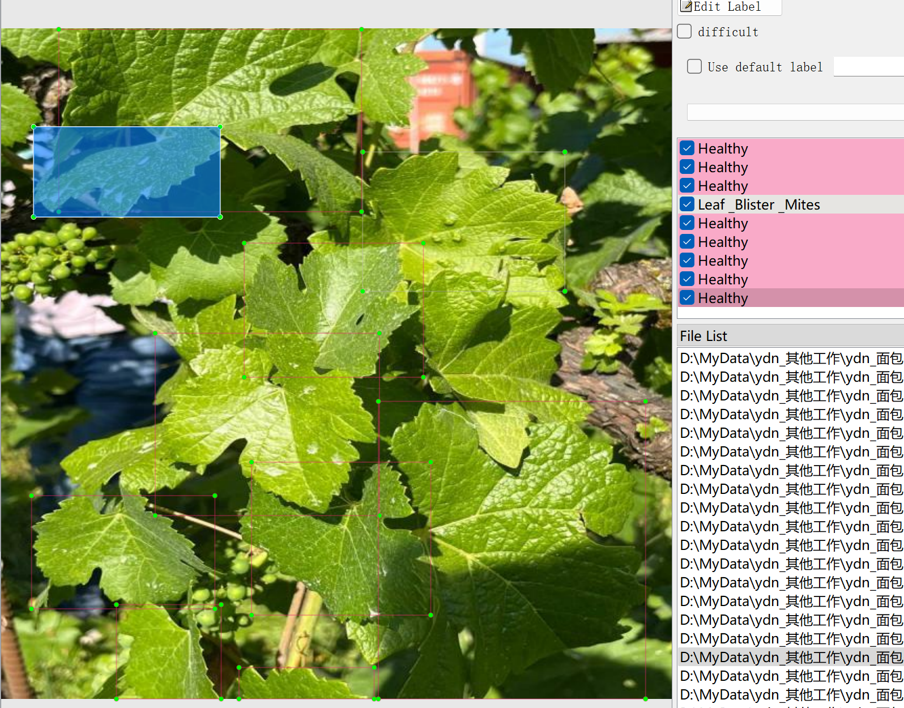

# 7 Types of Grape Leaf Diseases - Target Detection Dataset

Dataset Information: The dataset consists of 4270 images and corresponding annotation files. The annotation files are provided in two formats: VOC-formatted XML files and YOLO-formatted TXT files.

Annotation Objects: The following categories are annotated: ['BlackMeasles', 'Blackrot, Blight Fungus', 'Grape_esca', 'Grape_leaf_blight', 'Healthy', 'Leaf_Blister_Mites']

Image Counts and Annotation Box Counts for Each Category (Note: An image may be annotated with multiple objects, so the total number of annotation boxes may exceed the total number of images.)

The complete dataset includes three folders and one TXT file:
- all_txt folder and classes.txt: Stores the YOLO-formatted TXT annotations, in the same quantity as the images, each annotation file corresponds to a single image.
- classes.txt:
- all_xml file: VOC-formatted XML annotation file.
- The number and images are the same, each annotation file corresponds to a single image.

How to view the standard VOC format file can be found by searching on Baidu.

Both formats of annotations are usable; choose one of them based on your preference.

Annotation Screenshot:

Image

Here is a pay link on Stripe ( https://buy.stripe.com/3cs8yP7sY87d0vu9AB ). Please contact me lonlonago@foxmail.com after funding $89, and I will send you a complete data files , thank you!

